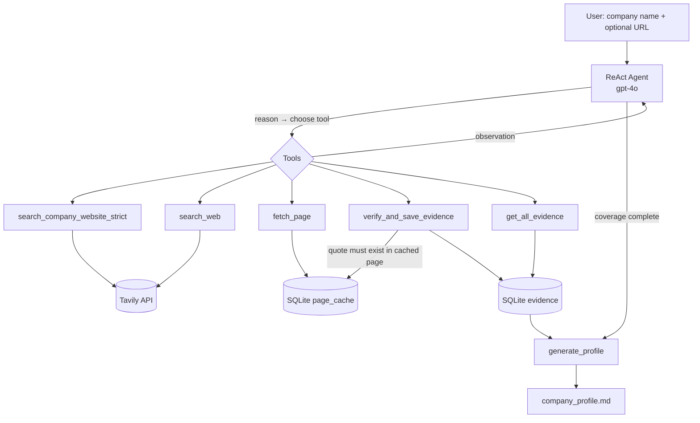

# Autonomous Company Research Agent

An AI agent that takes a **company name** (and optionally a website), decides for itself how to research it, and produces a **cited Markdown Company Profile** covering:

- **What they sell**: products, services, platforms
- **Who they sell to**: industries, company size, geography
- **Representative case studies**: customer stories, wherever the site hides them ("Resources", "Stories", "Customers", …)

Every claim in the final profile is backed by evidence (source URL + verbatim quote + confidence). When the agent can't verify something, it says **"unclear"** instead of guessing.

---

## Table of contents
1. [How autonomy is implemented](#1-how-autonomy-is-implemented)
2. [Architecture](#2-architecture)
3. [Tools](#3-tools)
4. [Evidence, anti-hallucination and confidence](#4-evidence-anti-hallucination-and-confidence)
5. [Setup](#5-setup)
6. [Running the agent](#6-running-the-agent)
7. [Output](#7-output)
8. [Logs and traces](#8-logs-and-traces)
9. [Example runs](#9-example-runs)
10. [Design decisions](#10-design-decisions)
11. [Known limitations and improvements](#11-known-limitations-and-improvements)

---

## 1. How autonomy is implemented

This is a **ReAct (Reason + Act) tool-calling agent**, not a fixed scrape-then-summarize pipeline. It is built with `langgraph.prebuilt.create_react_agent` and OpenAI `gpt-4o`.

The LLM runs in a loop:

1. **Reason** about what it knows and what is still missing.
2. **Act** by choosing one of five tools and its arguments.
3. **Observe** the tool result, whether that is page content, search hits, a rejected quote or an evidence summary.
4. **Decide** the next step: fetch another page, run a new search, save evidence, or stop.

Nothing about the research path is hard-coded. The agent decides:

- **Which pages to visit.** It reads the homepage, spots links such as `/solutions`, `/customers` or `/resources`, and follows only the relevant ones. There is no full crawl.
- **When to change strategy.** If on-site navigation doesn't surface case studies, it falls back to `search_web` (for example `"<company> case study"`) to find them elsewhere.
- **How to handle failures.** A 404, an empty JS-rendered page or a rejected quote comes back as an observation, and the agent reroutes around it.
- **When to stop.** It calls `get_all_evidence` to audit coverage and stops once every required field has evidence or is explicitly marked unverifiable.

The final profile is then produced by `generate_profile()`, which reads **only** from the evidence database. The model can't add facts at the writing stage.

---

## 2. Architecture



| Component | Implementation |
|---|---|
| Agent loop | `langgraph.prebuilt.create_react_agent` |
| LLM | OpenAI `gpt-4o` (agent reasoning + profile rendering) |
| Search | Tavily |
| Fetching | `requests` → BeautifulSoup → Markdown |
| Page cache | SQLite `page_cache` table in `agent_cache.db` |
| Evidence store | SQLite, in the same `agent_cache.db` |
| Tracing | Emoji-tagged console logs inside every tool |

All logic lives in a single file, `agent.py`, to keep the submission easy to review.

---

## 3. Tools

| # | Tool | Purpose | Key behaviour |
|---|---|---|---|
| 1 | `search_company_website_strict(name)` | Find the company's official website | Runs a Tavily search, parses each result's domain and applies a name-match heuristic, so partial matches (e.g. *Zylabs* for *Zycus*) are rejected. |
| 2 | `search_web(query)` | General web search mid-research | Used to find case studies, press releases or customer mentions that aren't linked from the main site. |
| 3 | `fetch_page(url)` | Read a page | HTTP GET → BeautifulSoup → clean Markdown. Checks the SQLite cache first; a cache hit returns instantly with no network call. |
| 4 | `verify_and_save_evidence(topic, claim, exact_quote, source_url, confidence, confidence_reason)` | Record a fact | **Anti-hallucination gate.** The quote must appear verbatim in the cached text of `source_url`. If it doesn't, the evidence is rejected and the agent is told why. |
| 5 | `get_all_evidence()` | Audit progress | Returns every saved evidence item. The agent uses it to find gaps, detect contradictions and decide when to stop. |

---

## 4. Evidence, anti-hallucination and confidence

**Programmatic verification, not prompt-only trust.** An LLM can be told "only cite real quotes", but it can still invent them. Here, `verify_and_save_evidence` checks the `exact_quote` against the page text stored in SQLite when `fetch_page` ran. A fabricated or paraphrased quote fails the check and never reaches the evidence store.

**Every claim is traceable.** Each evidence row stores:

- `topic` (offerings / customers / case studies)
- `claim`
- `exact_quote` (verified)
- `source_url`
- `confidence` (0.0–1.0) and `confidence_reason`

**Confidence and conflict detection.**
- Confidence rises when a claim is corroborated by a second independent source.
- Low or negative confidence flags **contradictions** between sources, which surface in the profile instead of being silently resolved.
- Fields with no verified evidence are rendered as **"unclear"**.

---

## 5. Setup

**Requirements:** Python 3.10+, an OpenAI API key, a Tavily API key.

```bash
git clone <repo-url>
cd agent_assignment

python -m venv .venv
# Windows
.venv\Scripts\activate
# macOS / Linux
source .venv/bin/activate

pip install -r requirements.txt
```

Core dependencies: `langgraph`, `langchain-openai`, `tavily-python`, `requests`, `beautifulsoup4`.

Create a `.env` file in the project root:

```env
OPENAI_API_KEY=sk-...
TAVILY_API_KEY=tvly-...
```

---

## 6. Running the agent

```bash
# By company name (the agent discovers the website itself)
python agent.py "Agilocrats"

# With a known website to skip discovery
python agent.py "Agilocrats" --url https://www.agilocrats.com
```

The agent prints its reasoning trace live (see [§8](#8-logs-and-traces)) and writes `<company>_profile.md` when it finishes.

---

## 7. Output

A Markdown Company Profile with this structure:

```markdown
# <Company> — Company Profile

## Overview
## What they sell
- <offering> — [source](url) · confidence 0.9
## Who they sell to
### Industries
### Company size
### Geography
## Case studies
- <customer> — <problem → solution → result> — [source](url)
## Unclear / unverified
## Sources
```

Each bullet links back to the evidence that supports it.

---

## 8. Logs and traces

Every tool prints emoji-tagged trace lines, so the agent's decisions can be followed in real time:

| Tag | Meaning |
|---|---|
| 🏢 | Domain match / rejection during website discovery |
| 🔍 | Web search issued (query shown) |
| 🌐 | Page fetched from the network |
| 📦 | Page served from SQLite cache |
| 📝 | Evidence verified and saved |
| 🚫 | Evidence rejected: quote not found on the page |

To save a full trace for review:

```bash
python agent.py "Agilocrats" > logs/agilocrats_trace.log 2>&1
```

---

## 9. Example runs

| Company | Site characteristics | Profile | Trace |
|---|---|---|---|
| Agilocrats | Consulting firm, services-led site | `agilocrats_profile.md` | `logs/agilocrats_trace.log` |
| _TBD_ | _e.g. JS-heavy SaaS site_ | _pending_ | _pending_ |
| _TBD_ | _e.g. enterprise site with case studies under "Resources"_ | _pending_ | _pending_ |

---

## 10. Design decisions

- **ReAct agent over a fixed pipeline.** The first version (V1) was a fixed-loop LangGraph StateGraph scraper. It always did the same steps regardless of what it found, which fails the "real agent" requirement. V2 hands every routing decision to the LLM.
- **ReAct over Deep Agents (for now).** LangChain Deep Agents was the original plan (planning, subagents, virtual FS). In practice, a single ReAct agent with well-designed tools met the requirements with less integration risk before the deadline. Subagents remain the main planned upgrade.
- **Evidence-first rendering.** The profile is generated from the evidence DB only, so the writing step can't introduce unsupported claims.
- **SQLite for both cache and evidence.** Zero setup, persists across runs, and lets quote verification run against exactly what the agent saw.
- **`gpt-4o` over `gpt-4o-mini`.** The smaller model was unreliable at structured tool calling (malformed arguments, skipped verification).
- **Single-file `agent.py`.** Easier for evaluators to read end to end. Splitting into modules is a straightforward refactor.

---

## 11. Known limitations and improvements

| Limitation | Impact | Planned improvement |
|---|---|---|
| No JS rendering (`requests` only) | SPA / heavily client-rendered sites may return near-empty pages | Playwright or Firecrawl fallback when fetched text is below a threshold |
| Sequential research | Slower on large sites | Parallel subagents (`offerings_researcher`, `customer_researcher`, `case_study_hunter`) via LangGraph `Send` or Deep Agents |
| No checkpoint/resume | A crash mid-run restarts from scratch (page cache still helps) | LangGraph `SqliteSaver` checkpointer keyed by run ID |
| No explicit page/token budget | Cost isn't hard-capped | Token/cost tracking + budget-based stopping rule |
| Output not schema-validated | Profile structure relies on the prompt | Pydantic `CompanyProfile` model; validator rejects claims without evidence IDs |
| Exact-match quote verification | Minor whitespace/formatting differences can reject valid quotes | Normalised or fuzzy matching with a high similarity threshold |
| Traces are console prints | Harder to analyse programmatically | Structured JSONL trace log alongside console output |
